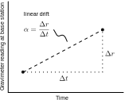

<!-- .slide: class="slide-title" data-background-color="#000000" data-background-image="../assets/background.jpg" data-background-repeat="no-repeat" data-background-opacity="0.45" data-background-position="center" -->

ENVS258 Environmental Geophysics
 
Gravimetry

# Ground-based gravimetry

## Instructor: **[Leonardo Uieda](https://www.leouieda.com)**

<i class="fas fa-envelope fa-fw"></i> [Leonardo.Uieda@liverpool.ac.uk](mailto:Leonardo.Uieda@liverpool.ac.uk)
|
<i class="fab fa-twitter fa-fw"></i> [@leouieda](https://twitter.com/leouieda)
|
[<i class="fab fa-creative-commons"></i><i class="fab fa-creative-commons-by"></i> CC-BY 4.0 License](https://creativecommons.org/licenses/by/4.0/)

<!------->

<!--
-->
<!--
-->

<!--# Learning outcomes-->

<!--1. Explain the workings on relative gravimeters-->
<!--1.-->

<!--
-->
<!--
-->

---

# Absolute gravimeters

Measure gravity acceleration along the vertical

High accuracy at [μGal level](http://microglacoste.com/wp-content/uploads/2018/02/FG5-X-Brochure.pdf)
(1e-8 m/s²)

Usually work by dropping a mass in a vacuum

Costly, large power consumption, long reading time, difficult to deploy in the
field (even the "portable" versions)

Progress is being made to make them more viable for field deployment (e.g., for
time-lapse measurements)

[Microg LaCoste A10 portable absolute gravimeter](http://microglacoste.com/product/a10-outdoor-absolute-gravimeter/)

Image credit: [Jeff Kennedy, USGS](https://www.usgs.gov/media/images/a10-absolute-gravity-meter)
(public domain)

---

# Relative gravimeters

Measure a change in gravity acceleration along the vertical

High accuracy at [μGal level](http://microglacoste.com/wp-content/uploads/2019/01/CG-6-Brochure_R5.pdf)
(1e-8 m/s²)

Usually a mass and spring system

Suffers from drift, requires referencing to a base station with known gravity

Light-weight, fast reading time, low power consumption, truly portable

[Microg LaCoste CG5 relative gravimeter](http://microglacoste.com/product/cg-6-autograv-gravity-meter/)

Image credit: [Sandeep vats](https://en.wikipedia.org/wiki/File:Autograv_CG5_P1150838.JPG)
(GNU FDL)

---

# Gravity networks

Tie relative measurements to a base station with known gravity (measured with
an absolute gravimeter)

1. Take a relative measurement at the base station
1. Measure on point 1
1. Calculate the difference
1. Add difference to known gravity

Image credit: Leonardo Uieda
(CC-BY)

---

# Gravity networks

Ideal survey would take measurements between all points

Gravity calculated through least-squares adjustment of the differences

More time-consuming so only done when high accuracy is required

Example: geodetic determination of a vertical datum (the geoid)

Image credit: Leonardo Uieda
(CC-BY)

---

# Gravity networks

Minimal network is a closed loop

Gravity is calculated by adding the difference in readings to known gravity at
the base station

Often used for regional geophysical surveys

Sensitive to errors since there are no redundant observations

Measure at the base station at the start and end to correct for instrumental
drift

Image credit: Leonardo Uieda
(CC-BY)

---

# Drift

Gravimeter readings drift with **time** so they reflect changes in gravity +
drift

Needs to be removed from observations

Take readings at base station twice and assume the drift is linear

Calculate drift on other points based on time of reading and remove it

`$ \text{drift}_i = \alpha \Delta t_i $`

Image credit: Leonardo Uieda
(CC-BY)

---

# Convert readings to mGal

Some gravimeters require conversion of meter readings to mGal (1 mGal = 1e-5
m/s²)

Use a conversion table provided by manufacturer (specific to each instrument)

(reading - range) * scale_factor + mGal_value

Example: reading = 2154.23

(2154.23 - 2100) * 1.00520 + 2111.66 = 2166.17 mGal

|Reading range|mGal value|scale factor|
|:---|:------|:------|
|1800|1810.10|1.00518|
|1900|1910.62|1.00518|
|2000|2011.14|1.00519|
|2100|2111.66|1.00520|
|2200|2212.18|1.00521|

Conversion table for LaCoste & Romberg Model G gravimeter. The more modern CG5
and CG6 don't require conversion (they give you the value in mGal directly).

---

# Leveling

The gravimeter is leveled (aligned with the vertical) before taking a reading

Manually using a bubble level in older models (newer models do this
automatically)

Vertical is defined as the direction of gravity

So what we measure is the **magnitude of the gravity acceleration vector**
 
(this will be important in the next lesson)

Example of a bubble level used to indicate if a surface is horizontal
(perpendicular to gravity).

Image credit: [aTarom](https://commons.wikimedia.org/wiki/File:DetalleNivelDeBurbuja.jpg)
(public domain)

---

# Not covered here

Solid Earth tides:

* Sun and Moon pull on the Earth, moving the ground up and down
* Causes measurable gravity differences

High precision surveying (microgravity):

* Used to detect small changes in gravity (microGal level)
* Examples: tunnels, chambers, caves, graves, etc
* Requires extra care with drift (linear assumption is not good enough)

---

# Not covered here (continued)

Atmospheric effects:

* Changes in pressure influence readings for high precision surveys

Glacial isostatic adjustment (GIA):

* Areas with "recent" lost of glaciers (northern Canada, Scandinavia, etc) are
  rebounding upward
* Change in height creates a change in measured gravity
* Visible effect when comparing multiple surveys

---

# Summary of acquisition

1. Start at a base station with known gravity
1. Level the gravimeter
1. Take reading, time, and position (lat, lon, height)
1. Repeat for other locations
1. Finish back at the base station

---

# Summary of processing

1. Calculate the drift rate
1. Remove drift from readings
1. Convert readings to mGal
1. Calculate mGal difference with base station
1. Add known gravity to the measured differences

---

<!-- END MATTER -->
<!-- ====================================================================== -->

<!-- .slide: class="slide-license" -->

<i class="fab fa-creative-commons"></i><i class="fab fa-creative-commons-by"></i>

Unless otherwise noted,
the contents of this lecture are
licensed under the
 
[Creative Commons Attribution 4.0 International License](https://creativecommons.org/licenses/by/4.0/).

